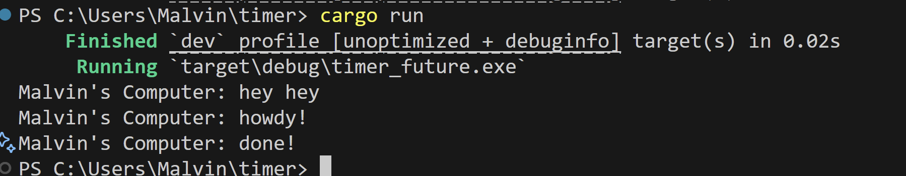
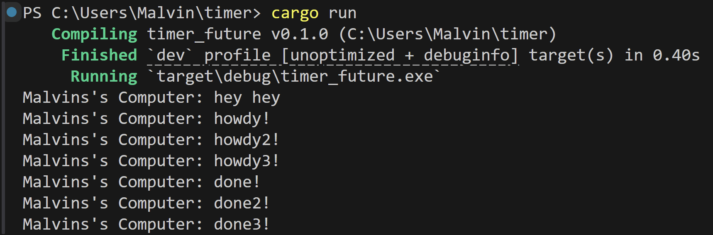
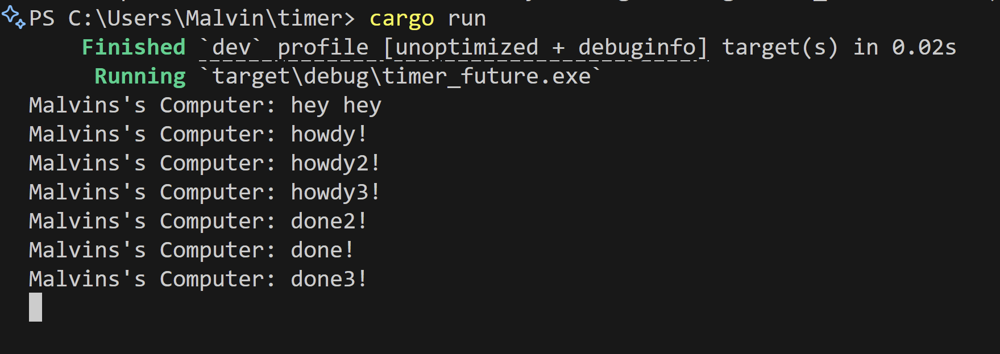

# Module 10 Reflection
## Malvin Muhammad Raqin - 2306275821

### 1. Print Task Outside Spawner

The output **"Malvin's Computer: hey hey"** appears first because it executes outside any asynchronous context and runs immediately as part of the regular synchronous flow within the `main()` function.

Meanwhile, the **"howdy!"** and **"done!"** outputs are contained within an async block that gets submitted to the task executor through the `spawner.spawn(...)` method. These asynchronous operations don't run immediately—instead, they get placed in a queue waiting for the executor to process them.

The execution order follows this pattern:
1. Synchronous code runs immediately, which includes `println!("Malvin's Computer: hey hey");`
2. The spawner gets dropped, indicating that no additional tasks will be submitted
3. `executor.run()` starts processing the queued asynchronous tasks, resulting in the delayed output of **"howdy!"**, followed by the timer wait, and finally **"done!"**

This demonstrates a fundamental principle in asynchronous Rust programming: async tasks are lazy by nature and only advance when actively polled by an executor. The spawned future remains dormant until `executor.run()` is invoked to drive it forward.

**2. How Multiple Tasks Work**

When i creates several tasks using the same `spawner`, this is the sequence:

**"Malvin's Computer: hey hey"** shows up first since it's normal code that executes instantly. After that, `executor.run()` kicks in and starts processing the tasks Malvin queued up.

All tasks display their **"howdy"**, **"howdy2"**, and **"howdy3"** messages following their creation order. Then, roughly 2 seconds later when the timers complete, their **"done"**, **"done2"**, and **"done3"** messages appear. The executor handles tasks as they become available, though the exact timing can shift based on when each timer finishes.

**3. What Happens Without `drop(spawner);`**

Without the `drop(spawner);` line, Malvin's program gets stuck and never terminates, even when all tasks complete their work. The reason is that the executor continues listening for incoming tasks through the communication channel. While the `spawner` remains active, the channel stays operational and the executor waits indefinitely.

**Key point: `drop(spawner)` is required to signal the executor that no additional tasks will be submitted, allowing Malvin's program to terminate properly once all work is done.**

